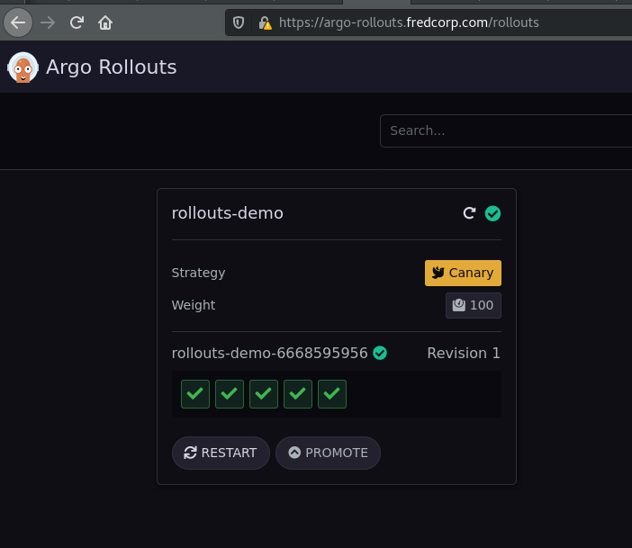

# 02 - Using Argo Rollouts
## Demo
### Deploying

You can follow the demonstration from official documentation here :

- https://argoproj.github.io/argo-rollouts/getting-started/

Just execute commands :

```
kubectl apply -f https://raw.githubusercontent.com/argoproj/argo-rollouts/master/docs/getting-started/basic/rollout.yaml
kubectl apply -f https://raw.githubusercontent.com/argoproj/argo-rollouts/master/docs/getting-started/basic/service.yaml
```

```console
[root@workstation ~ ]$ k get pods
NAME                             READY   STATUS    RESTARTS   AGE
rollouts-demo-6668595956-g4dwt   1/1     Running   0          5m24s
rollouts-demo-6668595956-r94wv   1/1     Running   0          5m24s
rollouts-demo-6668595956-rphwr   1/1     Running   0          5m24s
rollouts-demo-6668595956-s7rxm   1/1     Running   0          5m24s
rollouts-demo-6668595956-sfm4r   1/1     Running   0          5m24s
```

If you check dashboard you can see the rollout in the related namespace :

<p align="center">
  
</p>

<p align="center">
  
</p>

Otherwise, you can still check with CLI :

```
kubectl argo rollouts get rollout rollouts-demo --watch
```

```console
Name:            rollouts-demo
Namespace:       test
Status:          ✔ Healthy
Strategy:        Canary
  Step:          8/8
  SetWeight:     100
  ActualWeight:  100
Images:          argoproj/rollouts-demo:blue (stable)
Replicas:
  Desired:       5
  Current:       5
  Updated:       5
  Ready:         5
  Available:     5

NAME                                       KIND        STATUS     AGE  INFO
⟳ rollouts-demo                            Rollout     ✔ Healthy  14m  
└──# revision:1                                                        
   └──⧉ rollouts-demo-6668595956           ReplicaSet  ✔ Healthy  14m  stable
      ├──□ rollouts-demo-6668595956-g4dwt  Pod         ✔ Running  14m  ready:1/1
      ├──□ rollouts-demo-6668595956-r94wv  Pod         ✔ Running  14m  ready:1/1
      ├──□ rollouts-demo-6668595956-rphwr  Pod         ✔ Running  14m  ready:1/1
      ├──□ rollouts-demo-6668595956-s7rxm  Pod         ✔ Running  14m  ready:1/1
      └──□ rollouts-demo-6668595956-sfm4r  Pod         ✔ Running  14m  ready:1/1
```

### Updating

Next it is time to perform an update. Just as with Deployments, any change to the Pod template field (`spec.template`) results in a new version (i.e. ReplicaSet) to be deployed. Updating a Rollout involves modifying the rollout spec, typically changing the container image field with a new version, and then running `kubectl apply` against the new manifest. As a convenience, the rollouts plugin provides a `set image` command, which performs these steps against the live rollout object in-place.

```
kubectl argo rollouts set image rollouts-demo \
  rollouts-demo=argoproj/rollouts-demo:yellow
```

### Promoting

When a Rollout reaches a pause step with no duration, it will remain in a `paused` state indefinitely until it is resumed/promoted. To manually promote a rollout to the next step, run the `promote` command of the plugin:

```
kubectl argo rollouts promote rollouts-demo
```

Or you can use the Promote button from the GUI.

<p align="center">
  
</p>

### Aborting

This time, instead of promoting the rollout to the next step, we will abort the update, so that it falls back to the "stable" version. The plugin provides an `abort` command as a way to manually abort a rollout at any time during an update:

```
kubectl argo rollouts abort rollouts-demo
```

When a rollout is aborted, it will scale up the "stable" version of the ReplicaSet (in this case the yellow image), and scale down any other versions. Although the stable version of the ReplicaSet may be running and is healthy, the overall rollout is still considered `Degraded`, since the desired version (the red image) is not the version which is actually running.

In order to make Rollout considered Healthy again and not Degraded, it is necessary to change the desired state back to the previous, stable version. 

```
kubectl argo rollouts set image rollouts-demo \
  rollouts-demo=argoproj/rollouts-demo:yellow
```

## Using Argo Rollouts/ArgoCD with Istio

- https://argoproj.github.io/argo-rollouts/features/traffic-management/istio/

Earlier it was explained that VirtualServices should be deployed with an initial canary and stable weight of 0 and 100, respectively.

This introduces a problem for users practicing GitOps. Since a Rollout will modify these VirtualService weights as the Rollout progresses through its steps, it unfortunately causes the VirtualService to become OutOfSync with the version in git. Additionally, if the VirtualService in git were to be applied while the Rollout is in this state (splitting traffic between the services), the apply would revert the weights back to the values in git (i.e. 100 to stable, 0 to canary).

Some best practices to follow when using Argo CD with Argo Rollouts to prevent this behavior, is to leverage the following Argo CD features:

Configure the application to ignore differences in the VirtualService. e.g.:

```yaml
apiVersion: argoproj.io/v1alpha1
kind: Application
metadata:
  name: guestbook
spec:
  ignoreDifferences:
  - group: networking.istio.io
    kind: VirtualService
    jsonPointers:
    - /spec/http/0
```

Ignoring the differences in the VirtualServices HTTP route, prevents gitops differences in the VirtualService HTTP routes to contribute to the overall sync status of the Argo CD application. This adds the additional benefit of prevent auto-sync operations from being triggered.

Configure the Application to only apply OutOfSync resources:

```yaml
apiVersion: argoproj.io/v1alpha1
kind: Application
metadata:
  name: guestbook
spec:
  syncPolicy:
    syncOptions:
    - ApplyOutOfSyncOnly=true
```

By default, when Argo CD syncs an application, it runs `kubectl apply` against all resources in git which are part of the application. The `ApplyOutOfSyncOnly=true` sync option indicates to Argo CD to skip applying resources which it already considers `Synced`, and only apply the ones which are `OutOfSync`. This option, when used in conjunction with the `ignoreDifferences` feature, provides a way to manage the conflict in the desired state of a VirtualService between Argo CD and Argo Rollouts.

Final example:

```yaml
apiVersion: argoproj.io/v1alpha1
kind: Application
metadata:
  name: rollout-demo
spec:
  ignoreDifferences:
  - group: networking.istio.io
    kind: VirtualService
    jsonPointers:
    - /spec/http/0
  destination:
    name: ''
    namespace: test
    server: 'https://kubernetes.default.svc'
  source:
    path: istio-argoroll-ex
    repoURL: 'https://github.com/ixxeL2097/argo-deploy-test'
    targetRevision: HEAD
  project: default
  syncPolicy:
    automated:
      prune: true
      selfHeal: true
    syncOptions:
      - CreateNamespace=true
      - ApplyOutOfSyncOnly=true
```

## Grafana 

A dashboard for Grafana is available at :
- https://github.com/argoproj/argo-rollouts/blob/master/examples/dashboard.json